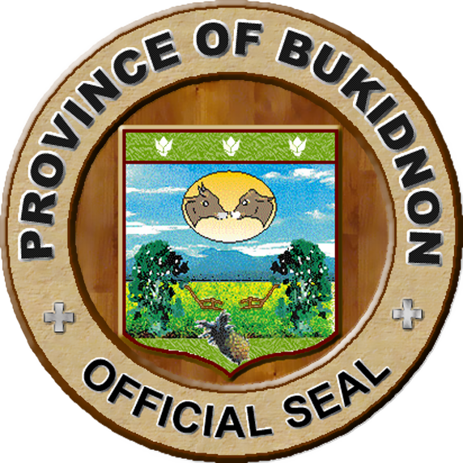

# Tindahan sa Bukid: An online shop by Bukidnon for Bukidnon

## The Local Government Unit of Bukidnon

Bukidnon is a province located in the central part of the island of Mindanao in the Philippines. It is bordered by the provinces of Agusan del Sur, Davao del Norte, and Misamis Oriental, as well as the regions of Caraga and Northern Mindanao. The capital of Bukidnon is the city of Malaybalay, which is located in the central part of the province.

Agriculture is a major economic activity in Bukidnon, with crops such as rice, corn, sugarcane, and coffee being grown in the province. The province is also known for its livestock, particularly cattle. There are also a number of small-scale industries in the province, including handicrafts, furniture-making, and food processing.

## Table of Contents

## Technologies

In order to make this project worked the following technologies were used:

* Laravel 

Laravel is a free, open-source PHP web framework used for web application development. It was created by Taylor Otwell and released in 2011. Laravel was used in this projects due to its built-in features and tools that make it easier in building web aplications, especially e-commerce sites.

* Breeze

Breeze is a library that provides a set of APIs for building .NET applications with a focus on simplicity, performance, and scalability. It is designed to be lightweight, modular, and easy to use, with a focus on providing high-quality APIs for data access, caching, validation, and other common application tasks.
