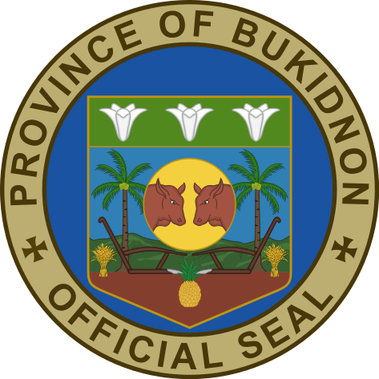

# Tindahan sa Bukid: An online shop by Bukidnon for Bukidnon

## The Local Government Unit of Bukidnon

Bukidnon is a province located in the central part of the island of Mindanao in the Philippines. It is bordered by the provinces of Agusan del Sur, Davao del Norte, and Misamis Oriental, as well as the regions of Caraga and Northern Mindanao. The capital of Bukidnon is the city of Malaybalay, which is located in the central part of the province.
Agriculture is a major economic activity in Bukidnon, with crops such as rice, corn, sugarcane, and coffee being grown in the province. The province is also known for its livestock, particularly cattle. There are also a number of small-scale industries in the province, including handicrafts, furniture-making, and food processing.
